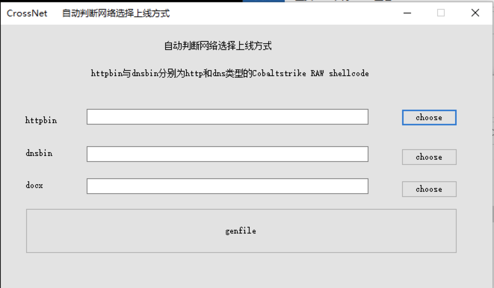
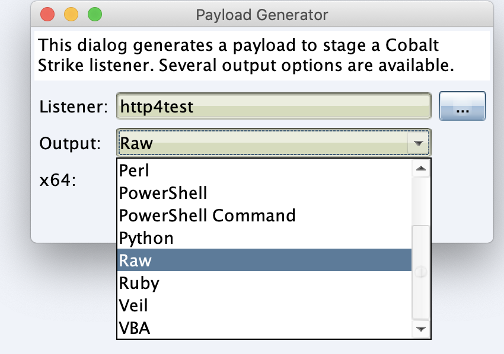
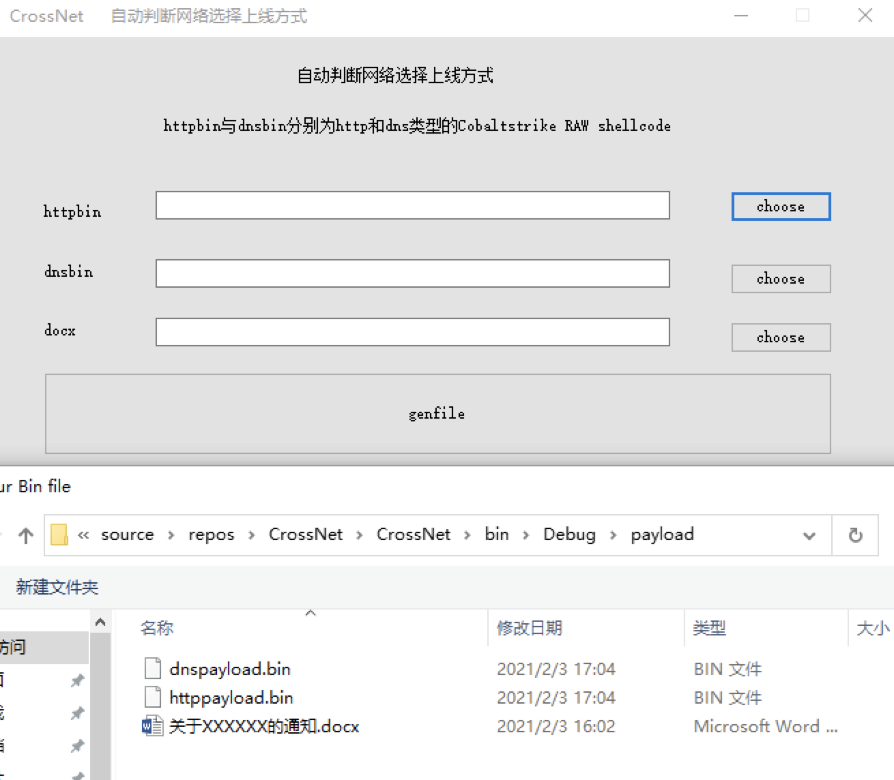
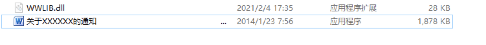
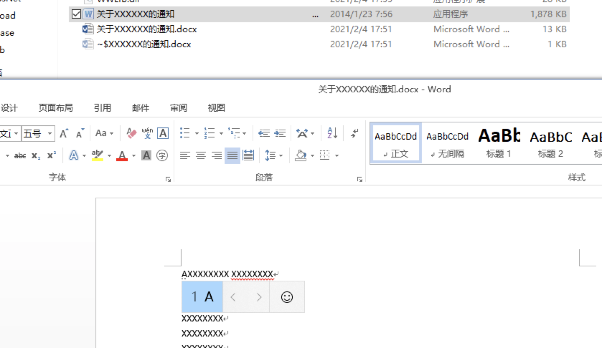
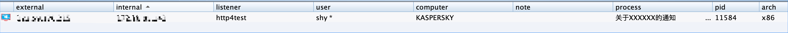

# CrossNet

通过判断目标是否出网，何种方式出网选择相应的方式上线。

选择CobaltStrike4.1  RAW格式shellcode  生成payload.bin  生成不同listener 的payload ，这里生成http和dns

点击choose将生成的payload或doc文件选择到对应选项

等待一会，成功生成目标文件和dll 到当前文件夹

点击会发现释放出真实docx文件并执行，并将exe文件设为隐藏。

过一会CS会上线。

## 注意

生成马需要visual studio环境，这里是visual studio 2017

# 已实现

判断出网方式 TCP、DNS   √

依据不同的出网方式进行shellcode加载  √

利用lolbins结合dll劫持执行shellcode  √

### Beta 1.0.2

修改可执行内存申请 后添加可执行权限√ 

添加sleep 万一能绕过沙箱√ 

将判断dns是否出网替换自己指向127.0.0.1 的域名 √

### Beta 1.1.0 

释放出word并将word文件名修改一致[Beta=1.1.0]√

设置当前EXE文件为隐藏[Beta=1.1.0]√

将shellcode加密存放在dll文件中[Beta=1.1.0]√

解密本地shellcode并运行shellcode [Beta=1.1.0]√

权限维持[Beta=1.1.0]√

进程注入到系统进程[Beta=1.1.0]√

新方式出网探测[[Beta=1.1.0]√

# TODO：

EXE自删除  

DNS beacon自动checkin

ICMP协议支持

寻找更可靠的权限维持方法

功能分化： 1. 免杀模式   2. 钓鱼模式（释放word）

免杀模式：
1. 其他白利用方式

钓鱼模式：
1. 添加chm帮助文件 白利用链

# 免杀测试：

## 静态扫描检测：

360杀毒                     未通过

360安全卫士              通过

火绒                            通过

## 动态执行扫描检测：

360杀毒                       通过

360安全卫士                通过

火绒                             通过 

# 问题：

比较优秀的支持icmp协议的远控？

# 免责声明

改工具仅限于安全研究使用、切勿用于非法用途。如红队使用请务必在授权状态下使用！

# THANKS
奇安信北京攻防团队。
摇人，摇人。简历发送至MTE4MzgzNDc1NAo=
